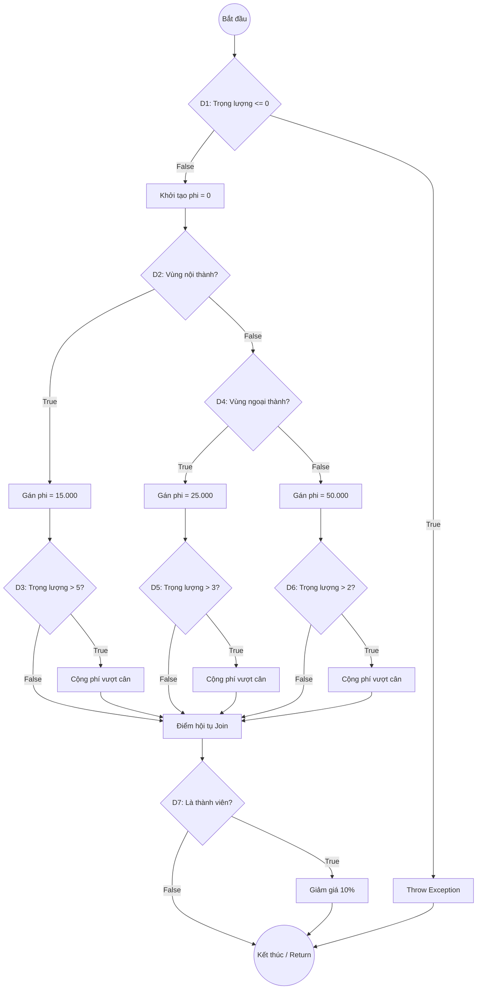

# Báo cáo phân tích Bài 4.1 – Basis Path Testing

## 1. Danh sách Decision Nodes (7 Decisions)
- **D1**: `if (trongLuong <= 0)`
- **D2**: `if (vung.equals("noi_thanh"))`
- **D3**: `if (trongLuong > 5)`
- **D4**: `else if (vung.equals("ngoai_thanh"))`
- **D5**: `if (trongLuong > 3)`
- **D6**: `if (trongLuong > 2)`
- **D7**: `if (laMember)`

## 2. Cyclomatic Complexity (CC)
- Công thức điểm quyết định: **CC = 7 + 1 = 8**
- Công thức đồ thị (E - N + 2P): **CC = 25 - 19 + 2(1) = 8**

## 3. Control Flow Graph (CFG)

## 4. Danh sách các đường đi độc lập (Basis Paths)

- **Path 1**: 1-2-3-19 (Lỗi trọng lượng)
- **Path 2**: 1-2-4-5-6-7-16-17-19 (Nội thành, <=5kg, Không Member)
- **Path 3**: 1-2-4-5-6-7-8-16-17-18-19 (Nội thành, >5kg, Member)
- **Path 4**: 1-2-4-5-9-10-11-16-17-19 (Ngoại thành, <=3kg, Không Member)
- **Path 5**: 1-2-4-5-9-10-11-12-16-17-18-19 (Ngoại thành, >3kg, Member)
- **Path 6**: 1-2-4-5-9-13-14-16-17-19 (Vùng khác, <=2kg, Không Member)
- **Path 7**: 1-2-4-5-9-13-14-15-16-17-18-19 (Vùng khác, >2kg, Member)
- **Path 8**: 1-2-4-5-6-7-16-17-18-19 (Nội thành, <=5kg, Member)

## 5. Bảng thiết kế bộ dữ liệu kiểm thử (Test Data)

| Path | trongLuong | vung | laMember | Expected Phi | Logic tính toán |
|---|---|---|---|---|---|
| P1 | -1 | "noi_thanh" | false | **Exception** | Trọng lượng âm |
| P2 | 5 | "noi_thanh" | false | **15000** | Nội thành, cân chuẩn |
| P3 | 6 | "noi_thanh" | true | **15300** | (15000 + 1*2000) * 0.9 |
| P4 | 3 | "ngoai_thanh" | false | **25000** | Ngoại thành, cân chuẩn |
| P5 | 4 | "ngoai_thanh" | true | **25200** | (25000 + 1*3000) * 0.9 |
| P6 | 2 | "vung_xa" | false | **50000** | Vùng khác, cân chuẩn |
| P7 | 3 | "vung_xa" | true | **49500** | (50000 + 1*5000) * 0.9 |
| P8 | 5 | "noi_thanh" | true | **13500** | 15000 * 0.9 |
